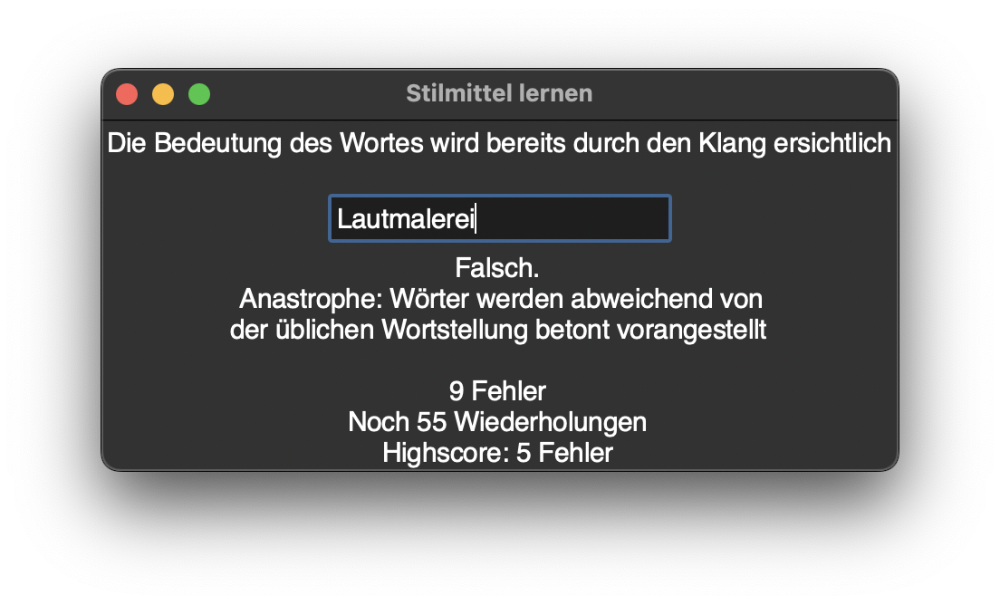

# stydev

Hallo,

dies ist ein kleines Programm in Python mit Tkinter, mit dem man rhetorische Stilmittel lernen kann. Der Hintergrund war, dass ich keine Lust hatte, in der Schule (ca. 9. Klasse) mein Glossar immer wieder zu erweitern und die Tabellen durchzugehen. Wieso nicht ein Programm schreiben, das für einen automatisch die Tabellen durchgeht und aussucht, welche Stilmittel noch gelernt werden müssen?

Das hier ist das Ergebnis – Im Grunde genommen kann man mit dem Programm hier auch Vokabeln etc. abfragen, wenn man die Stilmittel.txt ändert.

Um das Programm zu starten, einfach nur `Python` installieren und aus dem Ordner mit dem Befehl `python main.py` starten.

### Gallerie:

